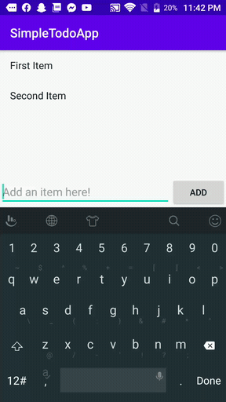

# Project 1 - *Simple todo App*

Simple todo App is an android app that allows users building a simple todo list and they can
add, edit and delete item in the list.

Submitted by: **Yves Ronaldo CAZEAU**

Time spent: **15 hours spent in total**

## User Stories

The following **required** functionality is completed:

* [x] User can **view a list of todo items**
* [x] User can **successfully add and remove items** from the todo list
* [x] User's **list of items persisted** uvpon modification and and retrieved properly on app restart

The following **optional** features are implemented:

* [x] User can **tap a todo item in the list and bring up an edit screen for the todo item** and then have any changes to the text reflected in the todo list

The following **additional** features are implemented:

* [] List anything else that you can get done to improve the app functionality!

## Video Walkthrough

Here's a walkthrough of implemented user stories:

GIF created with [ScreenCam](https://play.google.com/store/apps/details?id=com.orpheusdroid.screenrecorder&hl=fr).

## Notes

Describe any challenges encountered while building the app.
**I had many syntax problem for exemple when I had to type l I typed L...**
## License

    Copyright [2020] [Yves Ronaldo CAZEAU]

    Licensed under the Apache License, Version 2.0 (the "License");
    you may not use this file except in compliance with the License.
    You may obtain a copy of the License at

        http://www.apache.org/licenses/LICENSE-2.0

    Unless required by applicable law or agreed to in writing, software
    distributed under the License is distributed on an "AS IS" BASIS,
    WITHOUT WARRANTIES OR CONDITIONS OF ANY KIND, either express or implied.
    See the License for the specific language governing permissions and
    limitations under the License.
